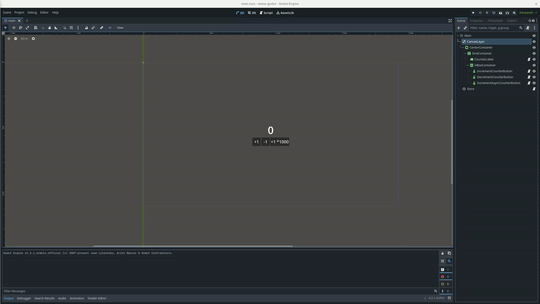

# Godot V4 rust counter

This repository contains a test implementation of a counter implemented in Rust for the business logic and Godot v4 for the front-end.

## Prerequisites

 - [Install Godot](https://godotengine.org/download)
 - [Install Rust](https://www.rust-lang.org/tools/install)

## Usage
First you need to compile rust business logic `cargo build`.

Then run `godot ./godot/project.godot` to update or run the GUI.

## Built With

* [Godot-rust](https://github.com/godot-rust/gdext) - Rust bindings for Godot 4
